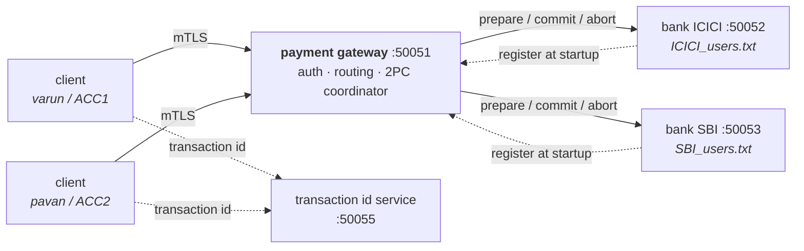
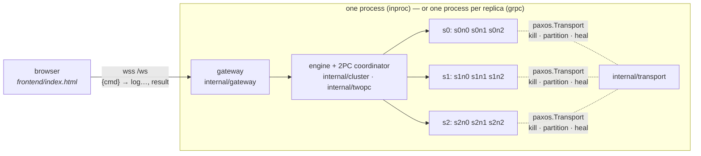

# paxos-2pc-kvstore — a distributed payment gateway

A small payment system built on gRPC, in the shape of a real one: clients talk
to a gateway over mutual TLS, the gateway routes payments to the banks that
hold each account, and a transfer between two banks is committed with
two-phase commit so it either happens at both banks or at neither.

Written in Go.



Each bank shown above is, underneath, a [Multi-Paxos](internal/paxos) group
that can be run as one replica (the diagram's default) or several. See
[Bank replication](#bank-replication) below.

There is also a **[browser control plane](#browser-control-plane)**: the same
Paxos engine running a sharded ledger you can break from a web terminal —
`kill` a leader, `partition` the network, and watch PREPARE, ACCEPT and 2PC
votes stream past live. It runs as one container on a free tier.

## What it does

| | |
|---|---|
| **Mutual TLS everywhere** | Every hop — client→gateway, bank→gateway, gateway→bank, client→transaction id service — presents a certificate signed by a private CA and verifies the other side. There is no plaintext hop. |
| **Password and session auth** | Passwords are stored as bcrypt hashes. Logging in returns an opaque random token that expires after 30 minutes; a gRPC interceptor rejects any call that does not carry a live one. |
| **Ownership checks** | A token identifies a user, and a user is bound to exactly one account id. You cannot transfer out of, or read the balance of, an account that is not yours — and you cannot register yourself against an account somebody else already claimed. |
| **Two-phase commit** | A cross-bank transfer runs PREPARE on both banks, and only commits once both have voted yes. PREPARE reserves the funds, so a commit that was voted for cannot later fail for lack of money. |
| **Idempotent transfers** | Every transfer carries an id issued by a central service. Banks record settled transactions in an append-only ledger and recognise a replay, so retrying a payment can never move the money twice. |
| **Durable offline queue** | A transfer the client cannot deliver is written to disk and retried with exponential backoff. It survives closing and reopening the client, and it reuses the original transaction id so the retry is safe. |
| **Simulated outages** | Type `down` or `up` into any gateway or bank window to take it offline and watch the retry, abort and reconciliation paths run. |
| **Replicated banks** | Each bank is a [Multi-Paxos](internal/paxos) group. Every prepare and commit is replicated to a majority before it takes effect, so one replica can crash mid-transfer and the group keeps serving with nothing lost. |

## Running it

You need Go 1.25+ and OpenSSL. On Windows, `run_all.bat` does everything below
in separate windows:

```bash
./generate_certs.sh          # or generate_certs.bat
go run ./transaction_id_server
go run ./gateway
go run ./bank -bank=ICICI -port=50052
go run ./bank -bank=SBI   -port=50053
go run ./client -username=varun -password=varun -account=ACC1 -bank=ICICI -register
```

Each command runs from the repository root. `-register` seeds the account with
an opening balance of 1000 if it does not exist yet.

To run a bank as a replicated group instead of a single instance, give every
replica an `-id` and the same `-peers` list (see
[Bank replication](#bank-replication)), or just run
`run_all_replicated.bat`, which starts both banks as 3-member groups.

The `.proto` files are already compiled into `proto/`, so `protoc` is only
needed if you change them:

```bash
protoc --go_out=. --go-grpc_out=. --proto_path=proto proto/payment.proto proto/transaction_id.proto
```

## How a transfer works

```
client                gateway                 sender bank         receiver bank
  |                      |                         |                    |
  |-- TransferMoney ---->|                         |                    |
  |                      |-- PrepareDebit -------->|  reserve funds     |
  |                      |<--------------- vote yes|                    |
  |                      |-- PrepareCredit ------------------------->|  check account
  |                      |<------------------------------- vote yes  |
  |                      |                         |                    |
  |                      |== decision: COMMIT =====|                    |
  |                      |-- CommitDebit --------->|  balance -= amount |
  |                      |-- CommitCredit ------------------------->|  balance += amount
  |<--- success ---------|                         |                    |
```

Two rules make this safe:

**PREPARE reserves, it does not just check.** The available balance for a
debit is the stored balance minus every outstanding reservation on that
account. Two concurrent transfers cannot both pass the funds check and then
both commit into an overdraft.

**After both votes, the decision is final.** A bank that voted yes has promised
the commit will work, so the coordinator retries commits rather than changing
its mind — aborting after a successful debit commit is what would destroy
money. If a prepare fails, both reservations are released and nothing has
moved.

## Bank replication

Each bank is a [Multi-Paxos](internal/paxos) group: leader election plus
replication of an ordered command log. Started with no `-id` or `-peers`, a
bank is a single-member group — always its own leader — which is what keeps
the plain quickstart above unchanged. Give every replica an `-id` and the
same `-peers` list of `id=host:port` consensus addresses to run a real group:

```bash
go run ./bank -bank=ICICI -id=ICICI-1 -port=50110 -data=data/ICICI-1 \
  -peers=ICICI-1=localhost:50210,ICICI-2=localhost:50211,ICICI-3=localhost:50212
go run ./bank -bank=ICICI -id=ICICI-2 -port=50111 -data=data/ICICI-2 \
  -peers=ICICI-1=localhost:50210,ICICI-2=localhost:50211,ICICI-3=localhost:50212
go run ./bank -bank=ICICI -id=ICICI-3 -port=50112 -data=data/ICICI-3 \
  -peers=ICICI-1=localhost:50210,ICICI-2=localhost:50211,ICICI-3=localhost:50212
```

or just run `run_all_replicated.bat`, which starts both banks this way.

**What's replicated.** Every `PrepareDebit`/`PrepareCredit`,
`CommitDebit`/`CommitCredit` and `AbortDebit`/`AbortCredit` call becomes a
command in the group's Paxos log. A `bankStateMachine` (bank/statemachine.go)
applies that log to the same `*participant` — reservations, balances and the
ledger — identically on every replica, in the same order. A replica that
crashes and restarts, or falls behind and catches up, ends up in the same
state as the rest of the group by replaying the same log, not by trusting
whatever its own memory last held.

**How the gateway finds the leader.** Only the leader accepts prepares and
commits; a follower reports `Unavailable`, the same code a genuinely
unreachable bank produces. The gateway never needs to know this: each replica
calls the existing bank-to-gateway `BankRegister` RPC every time it *becomes*
leader, including after a failover election, and the gateway already replaces
a bank's registered address on every call. So the registry always points at a
reachable replica, and the gateway's retry logic (already written to treat
`Unavailable` as transient) is what carries a transfer across a leader change
mid-commit.

**Simulating a replica crash.** Typing `down` in a replica's console gates its
consensus traffic as well as its gRPC handlers — peers stop hearing from it,
so if it was leader, the group elects a new one, same as a real crash would
cause. `up` lets it rejoin, where it catches up on whatever it missed.

**What this does and doesn't fix.** It replaces "reservations are in memory"
and "one instance per bank, no replication" from the limitations below with a
bank that tolerates `⌊n/2⌋` replica failures. It does not give the *gateway
coordinator* a write-ahead log — that limitation, and the in-doubt window it
describes, is unchanged; only the banks are replicated here.

## Design notes

Things an interviewer tends to ask about, and the reasoning behind them.

**Why is the transaction id issued by a separate service, rather than by the
client?** Because the id is the idempotency key. A client that generated a
fresh id per attempt would turn one retried payment into several, and two
clients generating ids independently could collide. The service persists its
counter before handing out an id, so a crash can skip ids but never reissue
one — skipping is harmless, reissuing would let two payments share a key.

**Why is the ledger the idempotency index, rather than a separate table?**
Because the thing you actually need to know is "did this transfer already
settle here", and the ledger is the record of exactly that. It is replayed
into an in-memory set at start-up, so a restarted bank still recognises a
transfer it already applied.

**Why do failures travel as gRPC status codes rather than message strings?**
The original design decided whether to retry by searching error text for words
like `offline`, which silently broke whenever a message was reworded. Codes
give the client one honest question to ask: is this `Unavailable` (queue and
retry) or a refusal on the merits (give up)? The same predicate is used by the
client and the coordinator.

**Why does the commit phase not use the caller's context?** If the client gives
up waiting, the gateway still has to finish what both banks already agreed to.
Committing under the caller's context would cancel the transfer half-applied
the moment the client timed out.

**Why atomic file writes?** Balances live in CSV files that are rewritten in
full on every change. Writing in place means a crash mid-write leaves a
truncated file and the account data is gone. Each write goes to a temporary
file that is renamed over the original, which is atomic.

**What happens if a bank dies between the two commits?** The sender has been
debited and the receiver cannot be credited. The coordinator retries, and if
it still cannot get through it reports `DataLoss` and logs the transaction as
**in doubt** for reconciliation. This is the blocking window two-phase commit
is criticised for, and it is not papered over: automatically reversing the
debit would be wrong, because the receiving bank may have committed and simply
failed to reply.

## Known limitations

Deliberately not solved, and what solving them would take:

- **The coordinator has no write-ahead log.** If the gateway dies mid-commit,
  nothing replays the decision on restart — the transaction stays in doubt
  until a human looks. A real coordinator journals its decision before phase
  two and recovers from that journal.
- **Money is a `float64`.** It should be an integer number of minor units;
  binary floating point cannot represent 0.10 exactly. Changing it means
  changing the `.proto`, which is why it has not been done here.
- **Storage is CSV files.** Every balance change rewrites the whole file under
  a mutex. It is readable and easy to inspect during a demo, and it is the
  first thing that would be replaced by a real database.
- **Sessions are in memory.** Restarting the gateway invalidates every token
  and clients must log in again.
- **One gateway.** There is no load balancing or replication of the gateway
  itself, only of the banks behind it (see [Bank replication](#bank-replication)).
  A bank started without `-id`/`-peers` is also still a single instance with
  in-memory reservations, exactly as before — replication is opt-in.

## Browser control plane

A second way to run the engine, built for showing it rather than for moving
real money: **3 shards × 3 replicas**, each shard a Multi-Paxos group from
[`internal/paxos`](internal/paxos) replicating an `account → integer balance`
ledger, with two-phase commit across shard leaders. A static page
([`frontend/index.html`](frontend/index.html), xterm.js) opens a WebSocket to
the backend, sends typed commands, and renders the cluster's protocol traffic
as it happens.



### Run it locally

```bash
go run ./cmd/cluster
```

That starts the gateway on `:8080` (or `$PORT`). Open `frontend/index.html`
in a browser — straight from disk, or through any static server — and it
connects to `ws://localhost:8080/ws` by default; the URL box in the header
takes any other endpoint. Hit **run tour** for a guided walkthrough, or type:

```
status                       leaders, terms, liveness; accounts and their shard
put tushar 100               Paxos write on the key's shard
get tushar                   linearizable read, served through the log
transfer tushar varun 25     2PC across shards (single Paxos round if same shard)
kill s2n0 / revive s2n0      fail a replica; re-election if it led
partition s2n0 | s2n1 s2n2   split the network (unlisted nodes form one more group)
heal                         remove all partitions
datastore                    every replica's balances and log tail, side by side
```

Every connection gets its own freshly built cluster, destroyed on disconnect,
so one visitor's partition never leaks to the next.

### Transports

Kill, partition and heal are injected in the transport, never in consensus:
the engine only ever sees a `Send` that fails. Both implementations satisfy
the engine's existing one-method `paxos.Transport`.

| `-transport=` | What runs | Use |
|---|---|---|
| `inproc` *(default)* | every replica is goroutines in one process; messages and replies travel over Go channels, and each can be dropped separately | local dev, and what gets deployed |
| `grpc` | one OS process per replica, real gRPC between them; the gateway pushes the fault table to every node, which enforces it on send **and** receive | a true multi-process cluster on one machine |

```bash
go run ./cmd/cluster -transport=grpc          # spawns 9 node processes on :7100-7108
```

In gRPC mode the replicas outlive any one browser connection, so every
connection drives the same shared cluster. Nodes can also be started by hand
(`-role=node -id=s0n0 -listen=127.0.0.1:7100 -peers=s0n0=…,s0n1=…,s0n2=…`)
and attached with `-attach=s0n0=host:port,…`. Other flags: `-shards`,
`-nodes` (or `SHARDS`/`NODES`), `-pace` (delay between streamed log lines,
presentation only), `-max-sessions`. The wire protocol and the design are in
[docs/control-plane.md](docs/control-plane.md).

### Deploy for free

Nothing here needs a card or a paid service: no database, no external state.

**Backend on Render (free web service).**

1. Push the repo to GitHub.
2. In Render: **New → Blueprint**, pick the repo. It reads
   [`render.yaml`](render.yaml): Docker runtime, free plan, health check on
   `/healthz`. (Or **New → Web Service**, runtime Docker, instance type Free.)
3. The endpoint is `wss://<service-name>.onrender.com/ws`. Render terminates
   TLS; the container just binds `$PORT`.

The free instance sleeps after 15 minutes without traffic, and the next visit
waits roughly a minute for a cold start while the page shows *connecting*.
For a portfolio demo that is an acceptable trade — and since state is in
memory per connection, nothing is lost by sleeping.

**Backend on Fly.io (alternative).**

```bash
fly launch --no-deploy --copy-config   # uses fly.toml; pick a unique app name
fly deploy
```

`fly.toml` stops the machine when idle and starts it on the next request. The
endpoint is `wss://<app>.fly.dev/ws`.

**Frontend on Vercel or GitHub Pages.** The frontend is a single static file
with no build step.

- *Vercel:* **Add New → Project**, import the repo, set **Root Directory** to
  `frontend`, framework preset **Other**, deploy.
- *GitHub Pages* (free on public repos): **Settings → Pages → Source: GitHub
  Actions**. [`.github/workflows/pages.yml`](.github/workflows/pages.yml)
  then publishes `frontend/` on every push to `main` that touches it, at
  `https://<user>.github.io/<repo>/`.

Then point it at the backend: paste `wss://<service>.onrender.com/ws` into the
header's URL box once (it is remembered per browser), or edit the fallback in
`defaultURL()` in `frontend/index.html` so first-time visitors connect
automatically.

> **Gotcha: `ws://` from an HTTPS page is blocked.** Browsers treat a `ws://`
> socket opened from an `https://` page as mixed content and refuse it, with
> nothing more helpful than a failed connection. A frontend on Vercel or
> Pages is always HTTPS, so the backend URL **must** be `wss://` — which
> Render and Fly provide. Only a page served over `http://localhost` (or
> opened from disk) can use `ws://localhost:8080/ws`. The page checks for
> this and says so instead of failing silently.

## Layout

```
gateway/     auth, session tokens, interceptors, bank registry, 2PC coordinator
bank/        2PC participant + Paxos state machine, up/down switch  (unit tested)
client/      interactive menu, durable offline queue, account seeding
transaction_id_server/
             hands out the ids that make retries idempotent
cmd/cluster/ browser control plane: cluster + WebSocket gateway in one binary
frontend/    the control plane's static xterm.js page
internal/
  accounts/  CSV account store with atomic writes  (unit tested)
  paxos/     Multi-Paxos: leader election, replicated log, mTLS transport  (unit tested)
  cluster/   control plane engine: shards of paxos.Node, faults, narration  (tested)
  ledger/    integer-balance state machine with 2PC locks  (unit tested)
  twopc/     cross-shard two-phase-commit coordinator
  transport/ inproc (channels) and gRPC paxos.Transport, with fault injection
  gateway/   WebSocket protocol, command parser, per-connection sessions  (tested)
  logstream/ the closed set of log levels the frontend colours
  tlsconfig/ mutual TLS credentials for every hop
  logx/      terminal colours
proto/       service definitions and generated code
certs/       generated key material — not committed; run generate_certs
data/        per-replica account/ledger/Paxos-log directories for a replicated bank group — not committed
```

## Tests

```bash
go test ./...
go test -race ./...
```

The suite covers the parts where a mistake costs money: reservations
preventing overdrafts under concurrency, replayed transfers applying exactly
once, retried commits being idempotent, commits having to match what was
prepared, aborts releasing reservations, and the ledger surviving a restart —
plus, for a replicated bank group, a prepare and commit converging onto every
replica and a commit surviving the leader that made it crashing immediately
after (`bank/statemachine_test.go`). The Paxos protocol itself — elections,
partitions, log recovery — is covered separately in `internal/paxos`.

## Licence

MIT — see [LICENSE](LICENSE).
