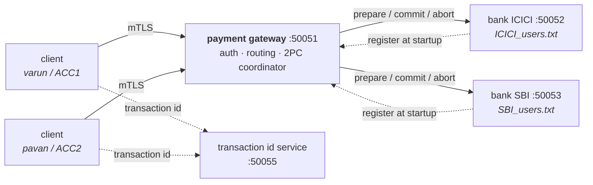

# paxos-2pc-kvstore — a distributed payment gateway

A small payment system built on gRPC, in the shape of a real one: clients talk
to a gateway over mutual TLS, the gateway routes payments to the banks that
hold each account, and a transfer between two banks is committed with
two-phase commit so it either happens at both banks or at neither.

Written in Go.



## What it does

| | |
|---|---|
| **Mutual TLS everywhere** | Every hop — client→gateway, bank→gateway, gateway→bank, client→transaction id service — presents a certificate signed by a private CA and verifies the other side. There is no plaintext hop. |
| **Password and session auth** | Passwords are stored as bcrypt hashes. Logging in returns an opaque random token that expires after 30 minutes; a gRPC interceptor rejects any call that does not carry a live one. |
| **Ownership checks** | A token identifies a user, and a user is bound to exactly one account id. You cannot transfer out of, or read the balance of, an account that is not yours — and you cannot register yourself against an account somebody else already claimed. |
| **Two-phase commit** | A cross-bank transfer runs PREPARE on both banks, and only commits once both have voted yes. PREPARE reserves the funds, so a commit that was voted for cannot later fail for lack of money. |
| **Idempotent transfers** | Every transfer carries an id issued by a central service. Banks record settled transactions in an append-only ledger and recognise a replay, so retrying a payment can never move the money twice. |
| **Durable offline queue** | A transfer the client cannot deliver is written to disk and retried with exponential backoff. It survives closing and reopening the client, and it reuses the original transaction id so the retry is safe. |
| **Simulated outages** | Type `down` or `up` into any gateway or bank window to take it offline and watch the retry, abort and reconciliation paths run. |

## Running it

You need Go 1.25+ and OpenSSL. On Windows, `run_all.bat` does everything below
in separate windows:

```bash
./generate_certs.sh          # or generate_certs.bat
go run ./transaction_id_server
go run ./gateway
go run ./bank -bank=ICICI -port=50052
go run ./bank -bank=SBI   -port=50053
go run ./client -username=varun -password=varun -account=ACC1 -bank=ICICI -register
```

Each command runs from the repository root. `-register` seeds the account with
an opening balance of 1000 if it does not exist yet.

The `.proto` files are already compiled into `proto/`, so `protoc` is only
needed if you change them:

```bash
protoc --go_out=. --go-grpc_out=. --proto_path=proto proto/payment.proto proto/transaction_id.proto
```

## How a transfer works

```
client                gateway                 sender bank         receiver bank
  |                      |                         |                    |
  |-- TransferMoney ---->|                         |                    |
  |                      |-- PrepareDebit -------->|  reserve funds     |
  |                      |<--------------- vote yes|                    |
  |                      |-- PrepareCredit ------------------------->|  check account
  |                      |<------------------------------- vote yes  |
  |                      |                         |                    |
  |                      |== decision: COMMIT =====|                    |
  |                      |-- CommitDebit --------->|  balance -= amount |
  |                      |-- CommitCredit ------------------------->|  balance += amount
  |<--- success ---------|                         |                    |
```

Two rules make this safe:

**PREPARE reserves, it does not just check.** The available balance for a
debit is the stored balance minus every outstanding reservation on that
account. Two concurrent transfers cannot both pass the funds check and then
both commit into an overdraft.

**After both votes, the decision is final.** A bank that voted yes has promised
the commit will work, so the coordinator retries commits rather than changing
its mind — aborting after a successful debit commit is what would destroy
money. If a prepare fails, both reservations are released and nothing has
moved.

## Design notes

Things an interviewer tends to ask about, and the reasoning behind them.

**Why is the transaction id issued by a separate service, rather than by the
client?** Because the id is the idempotency key. A client that generated a
fresh id per attempt would turn one retried payment into several, and two
clients generating ids independently could collide. The service persists its
counter before handing out an id, so a crash can skip ids but never reissue
one — skipping is harmless, reissuing would let two payments share a key.

**Why is the ledger the idempotency index, rather than a separate table?**
Because the thing you actually need to know is "did this transfer already
settle here", and the ledger is the record of exactly that. It is replayed
into an in-memory set at start-up, so a restarted bank still recognises a
transfer it already applied.

**Why do failures travel as gRPC status codes rather than message strings?**
The original design decided whether to retry by searching error text for words
like `offline`, which silently broke whenever a message was reworded. Codes
give the client one honest question to ask: is this `Unavailable` (queue and
retry) or a refusal on the merits (give up)? The same predicate is used by the
client and the coordinator.

**Why does the commit phase not use the caller's context?** If the client gives
up waiting, the gateway still has to finish what both banks already agreed to.
Committing under the caller's context would cancel the transfer half-applied
the moment the client timed out.

**Why atomic file writes?** Balances live in CSV files that are rewritten in
full on every change. Writing in place means a crash mid-write leaves a
truncated file and the account data is gone. Each write goes to a temporary
file that is renamed over the original, which is atomic.

**What happens if a bank dies between the two commits?** The sender has been
debited and the receiver cannot be credited. The coordinator retries, and if
it still cannot get through it reports `DataLoss` and logs the transaction as
**in doubt** for reconciliation. This is the blocking window two-phase commit
is criticised for, and it is not papered over: automatically reversing the
debit would be wrong, because the receiving bank may have committed and simply
failed to reply.

## Known limitations

Deliberately not solved, and what solving them would take:

- **The coordinator has no write-ahead log.** If the gateway dies mid-commit,
  nothing replays the decision on restart — the transaction stays in doubt
  until a human looks. A real coordinator journals its decision before phase
  two and recovers from that journal.
- **Reservations are in memory.** A bank that restarts between prepare and
  commit forgets it voted yes, and the commit is rejected. Durable prepare
  records would fix this.
- **Money is a `float64`.** It should be an integer number of minor units;
  binary floating point cannot represent 0.10 exactly. Changing it means
  changing the `.proto`, which is why it has not been done here.
- **Storage is CSV files.** Every balance change rewrites the whole file under
  a mutex. It is readable and easy to inspect during a demo, and it is the
  first thing that would be replaced by a real database.
- **Sessions are in memory.** Restarting the gateway invalidates every token
  and clients must log in again.
- **One gateway, one instance per bank.** There is no load balancing or
  replication.

## Layout

```
gateway/     auth, session tokens, interceptors, bank registry, 2PC coordinator
bank/        2PC participant: reservations, commits, ledger, up/down switch
client/      interactive menu, durable offline queue, account seeding
transaction_id_server/
             hands out the ids that make retries idempotent
internal/
  accounts/  CSV account store with atomic writes  (unit tested)
  tlsconfig/ mutual TLS credentials for every hop
  logx/      terminal colours
proto/       service definitions and generated code
certs/       generated key material — not committed; run generate_certs
```

## Tests

```bash
go test ./...
go test -race ./...
```

The suite covers the parts where a mistake costs money: reservations
preventing overdrafts under concurrency, replayed transfers applying exactly
once, retried commits being idempotent, commits having to match what was
prepared, aborts releasing reservations, and the ledger surviving a restart.

## Licence

MIT — see [LICENSE](LICENSE).
