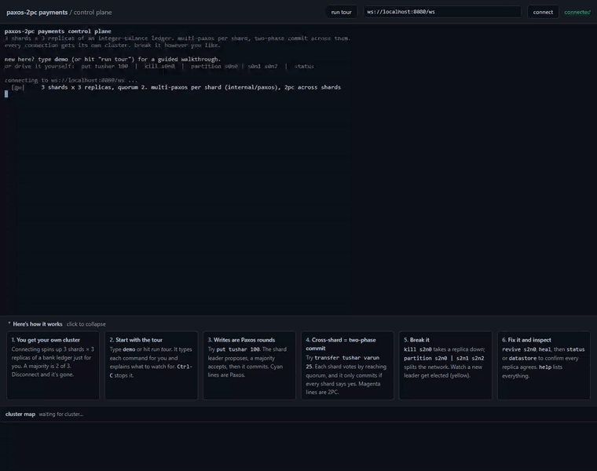
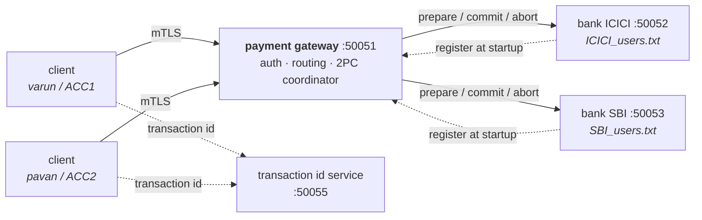

# paxos-2pc-payments

A distributed payment system in Go. Clients pay each other through a gateway,
money moves between banks with two-phase commit, and every bank is a Multi-Paxos
group that keeps working when a replica crashes. There's also a browser
terminal where you can kill nodes and split the network while it runs.



*The guided tour running at 2.5× speed. The terminal shows each Paxos and 2PC
message as it happens, and the map underneath shows leaders, dead replicas,
the network split and balances as they change.*

## The short version, with Pokémon

Think of it as trading Pokémon, where the Pokémon is money.

| In this repo | In Pokémon |
|---|---|
| **Client** | A trainer who wants to send something to another trainer. |
| **Bank** | A Pokémon Center that stores trainers' stuff. ICICI is the Viridian City center, SBI is the Pewter City one. |
| **Gateway** | The Cable Club receptionist. Checks your Trainer ID (mTLS + login), then connects you to the right centers. |
| **Two-phase commit** | A trade. Both sides see the offer and both press *confirm*. If either one backs out, or the link cable drops before both confirm, nobody loses anything. |
| **Transaction id** | A trade ticket with a serial number. Mash the trade button twice and the center sees the same ticket and ignores the second one. No duplication glitch. |
| **Paxos replicas** | Bill's PC saving your box on three machines. A save only counts once two of the three have written it, so one machine fainting loses nothing. |
| **Leader election** | The gym leader. Only the leader takes challenges. If they faint, the remaining gym trainers pick a new leader, and that leader carries on with the same records. |
| **Partition** | A link cable cut in half. Everyone is still awake, they just can't reach each other, so nobody is allowed to act as leader alone. |

The rest of this README says the same thing without the Pokémon.



Each bank in the diagram is a [Multi-Paxos](internal/paxos) group underneath.
By default it runs as one replica, but you can run several. See
[Bank replication](#bank-replication).

The **[browser control plane](#browser-control-plane)** runs the same Paxos
engine as a sharded ledger in a web terminal. You can `kill` a leader,
`partition` the network, and watch PREPARE, ACCEPT and 2PC votes scroll by as
they happen. It runs as a single container on a free tier.

## What it does

| | |
|---|---|
| **Mutual TLS everywhere** | Every connection (client to gateway, bank to gateway, gateway to bank, client to the transaction id service) shows a certificate signed by a private CA and checks the other side's. Nothing travels in plaintext. |
| **Password and session auth** | Passwords are stored as bcrypt hashes. Logging in gives you a random token that expires after 30 minutes, and a gRPC interceptor rejects any call without a valid one. |
| **Ownership checks** | Each token belongs to one user, and each user owns exactly one account. You can't send money from, or check the balance of, someone else's account. You also can't register against an account someone already claimed. |
| **Two-phase commit** | A transfer between banks runs PREPARE on both and only commits after both vote yes. PREPARE sets the money aside, so a commit both banks agreed to can't fail later for lack of funds. |
| **Idempotent transfers** | Every transfer carries an id from a central service. Banks keep an append-only ledger of settled transfers and spot repeats, so retrying a payment never moves the money twice. |
| **Durable offline queue** | If the client can't deliver a transfer, it saves it to disk and retries with exponential backoff. The queue survives restarting the client and keeps the original transaction id, so retries stay safe. |
| **Simulated outages** | Type `down` or `up` in any gateway or bank window to take it offline and watch the retry, abort and recovery paths kick in. |
| **Replicated banks** | Each bank is a [Multi-Paxos](internal/paxos) group. Every prepare and commit reaches a majority of replicas before it takes effect, so a replica can crash in the middle of a transfer and nothing is lost. |

## Running it

You need Go 1.25+ and OpenSSL. On Windows, `run_all.bat` does all of this in
separate windows:

```bash
./generate_certs.sh          # or generate_certs.bat
go run ./transaction_id_server
go run ./gateway
go run ./bank -bank=ICICI -port=50052
go run ./bank -bank=SBI   -port=50053
go run ./client -username=varun -password=varun -account=ACC1 -bank=ICICI -register
```

Run each command from the repository root. `-register` creates the account
with 1000 in it if it doesn't exist yet.

To run a bank as a replicated group, give each replica an `-id` and the same
`-peers` list (see [Bank replication](#bank-replication)), or just run
`run_all_replicated.bat`, which starts both banks with 3 replicas each.

The `.proto` files are already compiled into `proto/`. You only need `protoc`
if you change them:

```bash
protoc --go_out=. --go-grpc_out=. --proto_path=proto proto/payment.proto proto/transaction_id.proto
```

## How a transfer works

```
client                gateway                 sender bank         receiver bank
  |                      |                         |                    |
  |-- TransferMoney ---->|                         |                    |
  |                      |-- PrepareDebit -------->|  reserve funds     |
  |                      |<--------------- vote yes|                    |
  |                      |-- PrepareCredit ------------------------->|  check account
  |                      |<------------------------------- vote yes  |
  |                      |                         |                    |
  |                      |== decision: COMMIT =====|                    |
  |                      |-- CommitDebit --------->|  balance -= amount |
  |                      |-- CommitCredit ------------------------->|  balance += amount
  |<--- success ---------|                         |                    |
```

Two rules keep this safe.

**PREPARE sets money aside, it doesn't just look.** The spendable balance is
the stored balance minus everything already reserved on that account. So two
transfers at the same time can't both pass the check and then both commit into
an overdraft.

**Once both banks vote yes, the decision is final.** A bank that voted yes has
promised the commit will work, so the coordinator keeps retrying the commit
instead of changing its mind. Aborting after the debit already committed is
exactly how money disappears. If a prepare fails, both reservations are
released and nothing has moved.

## Bank replication

Each bank is a [Multi-Paxos](internal/paxos) group: it elects a leader and
replicates an ordered log of commands. Start a bank with no `-id` or `-peers`
and it's a group of one that is always its own leader, which is why the
quickstart above still works unchanged. To run a real group, give every
replica an `-id` and the same `-peers` list of `id=host:port` addresses:

```bash
go run ./bank -bank=ICICI -id=ICICI-1 -port=50110 -data=data/ICICI-1 \
  -peers=ICICI-1=localhost:50210,ICICI-2=localhost:50211,ICICI-3=localhost:50212
go run ./bank -bank=ICICI -id=ICICI-2 -port=50111 -data=data/ICICI-2 \
  -peers=ICICI-1=localhost:50210,ICICI-2=localhost:50211,ICICI-3=localhost:50212
go run ./bank -bank=ICICI -id=ICICI-3 -port=50112 -data=data/ICICI-3 \
  -peers=ICICI-1=localhost:50210,ICICI-2=localhost:50211,ICICI-3=localhost:50212
```

Or run `run_all_replicated.bat`, which starts both banks this way.

**What gets replicated.** Every `PrepareDebit`/`PrepareCredit`,
`CommitDebit`/`CommitCredit` and `AbortDebit`/`AbortCredit` call becomes an
entry in the group's Paxos log. A `bankStateMachine` (bank/statemachine.go)
applies that log to the reservations, balances and ledger in the same order on
every replica. A replica that crashes and comes back, or falls behind, catches
up by replaying the log rather than trusting whatever it remembered.

**How the gateway finds the leader.** Only the leader accepts prepares and
commits. A follower answers `Unavailable`, the same thing an unreachable bank
returns. The gateway doesn't need to know about leaders at all: whenever a
replica *becomes* leader (including after a failover), it calls the existing
`BankRegister` RPC, and the gateway already overwrites a bank's address on
every call. So the gateway always points at a live replica, and its retry logic
(which already treats `Unavailable` as temporary) carries a transfer across a
leader change.

**Simulating a crash.** Typing `down` in a replica's window cuts its consensus
traffic as well as its gRPC handlers. Its peers stop hearing from it, so if it
was leader the group elects a new one, just like a real crash. `up` brings it
back and it catches up on what it missed.

**What this fixes and what it doesn't.** It removes two of the old
limitations, "reservations are in memory" and "one instance per bank", and
gives you banks that survive `⌊n/2⌋` replica failures. It does *not* give the
gateway's coordinator a write-ahead log. That limitation and its in-doubt
window are unchanged, because only the banks are replicated.

## Design notes

Questions interviewers tend to ask, and the reasoning behind each answer.

**Why does a separate service hand out transaction ids instead of the client?**
Because the id is what makes retries safe. A client that made a new id for
every attempt would turn one retried payment into several, and two clients
making ids on their own could collide. The service saves its counter to disk
before handing out an id, so a crash can skip ids but never reuse one. Skipping
is harmless. Reusing would let two payments share a key.

**Why is the ledger the idempotency index instead of a separate table?**
The question you actually need answered is "did this transfer already settle
here?", and the ledger is the record of exactly that. It's loaded into an
in-memory set at startup, so a restarted bank still recognises transfers it
already applied.

**Why do errors travel as gRPC status codes instead of message strings?**
The first version decided whether to retry by searching the error text for
words like `offline`, which broke quietly every time someone reworded a
message. Status codes leave one clear question: is this `Unavailable` (queue it
and retry) or a real refusal (give up)? The client and the coordinator use the
same check.

**Why doesn't the commit phase use the caller's context?** If the client stops
waiting, the gateway still has to finish what both banks already agreed to.
Using the caller's context would cancel the transfer halfway through the
moment the client timed out.

**Why atomic file writes?** Balances live in CSV files that get rewritten on
every change. Writing in place means a crash mid-write leaves a half-written
file and the account data is gone. Instead each write goes to a temp file that
is then renamed over the original, and a rename is atomic.

**What if a bank dies between the two commits?** The sender has been debited
and the receiver can't be credited. The coordinator retries, and if it still
can't get through, it returns `DataLoss` and logs the transfer as **in doubt**
so someone can reconcile it. This is the blocking window two-phase commit is
known for, and the code doesn't pretend otherwise. Automatically reversing the
debit would be wrong, because the receiving bank might have committed and just
failed to reply.

## Known limitations

These are left unsolved on purpose. Here's what fixing each would take.

- **The coordinator has no write-ahead log.** If the gateway dies mid-commit,
  nothing replays the decision when it restarts, and the transfer stays in
  doubt until a person looks at it. A real coordinator writes its decision to a
  journal before phase two and recovers from that journal.
- **Money is a `float64`.** It should be a whole number of cents (or paise),
  because floating point can't represent 0.10 exactly. Fixing it means changing
  the `.proto`, which is why it hasn't been done.
- **Storage is CSV files.** Every balance change rewrites the whole file under
  a lock. That's easy to read during a demo, and it would be the first thing to
  swap for a real database.
- **Sessions live in memory.** Restarting the gateway logs everyone out.
- **There's one gateway.** Nothing load-balances or replicates the gateway,
  only the banks behind it (see [Bank replication](#bank-replication)). A bank
  started without `-id`/`-peers` is still a single instance with in-memory
  reservations, same as before. Replication is opt-in.

## Browser control plane

A second way to run the engine, built for showing it off rather than moving
real money: **3 shards × 3 replicas**. Each shard is a Multi-Paxos group from
[`internal/paxos`](internal/paxos) replicating an `account → integer balance`
ledger, with two-phase commit across shard leaders. A static page
([`frontend/index.html`](frontend/index.html), built on xterm.js) opens a
WebSocket to the backend, sends the commands you type, and prints the
cluster's protocol traffic as it happens.

Below the terminal and the how-it-works cards, a **live cluster map** draws what the server reports:
a crown on each shard's leader, a ✕ on killed replicas, dashed red links across
a partition, and every account's balance and lock. Each PREPARE, PROMISE,
ACCEPT and 2PC vote shows up as a dot travelling between the two nodes
involved, and a dropped message stops halfway and fades out.


### Run it locally

```bash
go run ./cmd/cluster
```

That starts the backend on `:8080` (or `$PORT`). Then serve the page:

```bash
python -m http.server 5500 --directory frontend
```

Open http://localhost:5500. The page connects to `ws://localhost:8080/ws` on
its own as soon as it loads, and you get a fresh cluster. You can type another
address into the box in the header. Click **run tour** (or type `demo`) for a
guided walkthrough, or try these:

```
status                       leaders, terms, liveness; accounts and their shard
put tushar 100               Paxos write on the key's shard
get tushar                   linearizable read, served through the log
transfer tushar varun 25     2PC across shards (one Paxos round if same shard)
kill s2n0 / revive s2n0      fail a replica; re-election if it was leader
partition s2n0 | s2n1 s2n2   split the network (unlisted nodes form one more group)
heal                         remove all partitions
datastore                    every replica's balances and log tail, side by side
```

Every browser tab gets its own cluster, built when it connects and thrown away
when it disconnects, so one visitor's partition never affects the next.

### Transports

Kill, partition and heal happen in the transport layer, never inside
consensus. The engine only ever sees a `Send` that fails. Both transports
implement the engine's one-method `paxos.Transport` interface.

| `-transport=` | What runs | Use it for |
|---|---|---|
| `inproc` *(default)* | every replica is goroutines in one process; messages and replies go over Go channels, and each can be dropped on its own | local dev, and what gets deployed |
| `grpc` | one OS process per replica with real gRPC between them; the gateway pushes the fault table to every node, which enforces it on send **and** receive | a real multi-process cluster on one machine |

```bash
go run ./cmd/cluster -transport=grpc          # spawns 9 node processes on :7100-7108
```

In gRPC mode the replicas outlive any single browser connection, so every
visitor drives the same shared cluster. You can also start nodes by hand
(`-role=node -id=s0n0 -listen=127.0.0.1:7100 -peers=s0n0=…,s0n1=…,s0n2=…`) and
attach them with `-attach=s0n0=host:port,…`. Other flags: `-shards`, `-nodes`
(or `SHARDS`/`NODES`), `-pace` (delay between log lines, just for readability),
and `-max-sessions`. The wire protocol and design are in
[docs/control-plane.md](docs/control-plane.md).

### Deploy for free

No card and no database needed. The backend goes on Render and the page goes
on GitHub Pages.

**1. Backend on Render**

1. Push the repo to GitHub.
2. In Render, click **New → Blueprint** and pick the repo. It reads
   [`render.yaml`](render.yaml): Docker, free plan, health check on `/healthz`.
3. When it's live, `https://<service-name>.onrender.com/healthz` should return
   `ok`. Your WebSocket address is `wss://<service-name>.onrender.com/ws`.

**2. Frontend on GitHub Pages** (the repo has to be public)

1. In the repo, go to **Settings → Pages → Source: GitHub Actions**.
2. Run the **pages** workflow once from the Actions tab. After that,
   [`.github/workflows/pages.yml`](.github/workflows/pages.yml) republishes
   `frontend/` on every push to `main` that touches it.
3. The site is at `https://<user>.github.io/<repo>/`.

**3. Point the page at the backend.** When the page isn't on localhost, it
connects to `wss://paxos-2pc-payments.onrender.com/ws`. If Render gave your
service a different name, change that address in `defaultURL()` in
`frontend/index.html` so first-time visitors connect without doing anything.

**About the free tier.** Render puts the service to sleep after about 15
minutes without traffic. When someone opens the page, it pings `/healthz`
until the backend wakes up (usually under a minute), shows *waking it up* in
the terminal while it waits, and then connects. Nothing is lost by sleeping,
since every cluster lives in memory for one visit anyway. If you want it
always awake, point a free uptime pinger at `/healthz` every 10 minutes.

**Fly.io instead of Render.** [`fly.toml`](fly.toml) is ready to go
(`fly launch --no-deploy --copy-config`, then `fly deploy`), but new Fly
accounts need a card on file.

> **Gotcha: `ws://` doesn't work from an HTTPS page.** Browsers block a
> `ws://` socket opened from an `https://` page as mixed content, and all you
> see is a failed connection. GitHub Pages is always HTTPS, so the backend
> address **must** start with `wss://`, which Render provides. Only a page on
> `http://localhost` can use `ws://localhost:8080/ws`. The page checks this and
> tells you instead of failing silently.

## Layout

```
gateway/     auth, session tokens, interceptors, bank registry, 2PC coordinator
bank/        2PC participant + Paxos state machine, up/down switch  (unit tested)
client/      interactive menu, durable offline queue, account seeding
transaction_id_server/
             hands out the ids that make retries idempotent
cmd/cluster/ browser control plane: cluster + WebSocket gateway in one binary
frontend/    the control plane's static page: xterm.js terminal + live cluster map
scripts/     record_demo.py rebuilds docs/demo.gif from the guided tour
internal/
  accounts/  CSV account store with atomic writes  (unit tested)
  paxos/     Multi-Paxos: leader election, replicated log, mTLS transport  (unit tested)
  cluster/   control plane engine: shards of paxos.Node, faults, narration  (tested)
  ledger/    integer-balance state machine with 2PC locks  (unit tested)
  twopc/     cross-shard two-phase-commit coordinator
  transport/ inproc (channels) and gRPC paxos.Transport, with fault injection
  gateway/   WebSocket protocol, command parser, per-connection sessions  (tested)
  logstream/ the fixed set of log levels the frontend colours
  tlsconfig/ mutual TLS credentials for every hop
  logx/      terminal colours
proto/       service definitions and generated code
certs/       generated key material, not committed; run generate_certs
data/        per-replica account, ledger and Paxos log directories, not committed
```

## Tests

```bash
go test ./...
go test -race ./...
```

The tests focus on the places where a bug costs money: reservations stopping
overdrafts under concurrency, replayed transfers applying exactly once,
retried commits being idempotent, commits matching what was prepared, aborts
releasing reservations, and the ledger surviving a restart. For replicated
banks, they also check that a prepare and commit reach every replica, and that
a commit survives the leader crashing right after making it
(`bank/statemachine_test.go`). The Paxos protocol itself (elections,
partitions, log recovery) is tested separately in `internal/paxos`.

## Licence

MIT. See [LICENSE](LICENSE).
